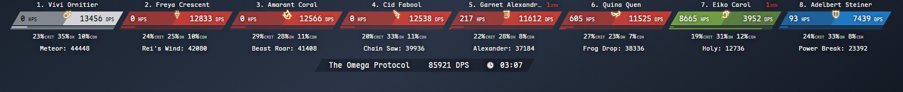
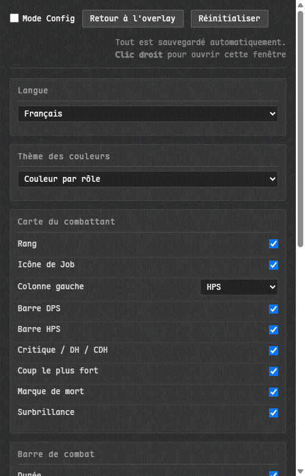
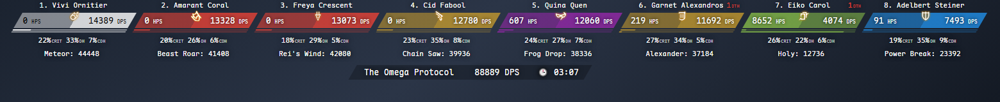
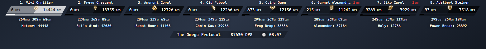
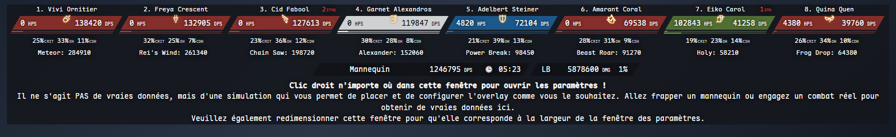
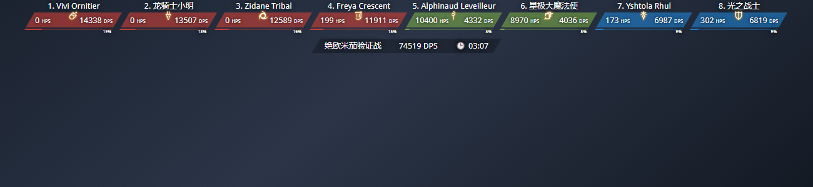
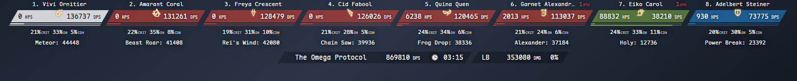
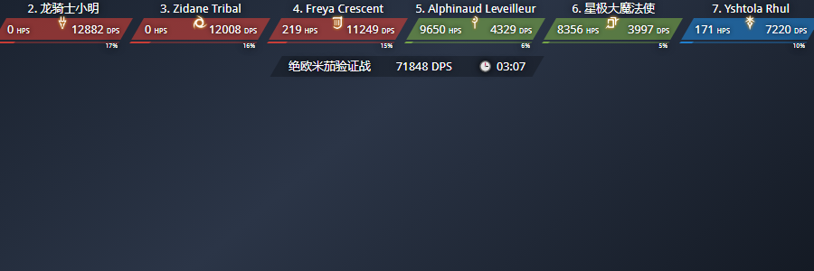
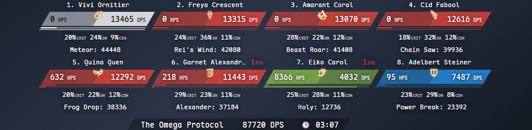

# Horizoverlay Reborn

[English](README.md) · [简体中文](README_zhCN.md) · [正體中文](README_zhHK.md) · [Português](README_ptBR.md) · Français

Un compteur de dégâts horizontal pour Final Fantasy XIV, qui affiche le DPS et le HPS de toute l'équipe sur une rangée de cartes. Une refonte de [Horizoverlay](https://github.com/bsides/horizoverlay).



## Installation

1. Dans OverlayPlugin, créez un overlay de type MiniParse
2. Mettez cette URL :

   ```
   https://garfieldzasv.github.io/horizoverlay-reborn/
   ```

3. Désactivez **Enable clickthru** sur cet overlay, sinon le clic droit n'ouvre pas les paramètres
4. Faites un clic droit sur l'overlay pour ouvrir les paramètres

Si vous préférez ne pas dépendre du réseau, téléchargez le zip depuis [Releases](https://github.com/garfieldzasv/horizoverlay-reborn/releases) et décompressez-le. Un OverlayPlugin récent -- celui que livrent les packs ACT tout-en-un -- a un bouton `...` à côté du champ URL : cliquez dessus et choisissez `index.html` dans le dossier, sans chemin à composer. Sur une version plus ancienne, saisissez vous-même le chemin `file://` complet. C'est la même build que la page hébergée, mais l'hébergée conserve mieux vos paramètres, les navigateurs bloquant `localStorage` sur les chemins `file://`.

Largeur de fenêtre : une rangée de 4 demande 759px, 6 en demandent 1138px, 8 en demandent 1517px, 12 en demandent 2276px, 24 en demandent 4551px. Les cartes passent à la ligne quand elles ne rentrent pas.

ACTWebSocket fonctionne aussi, il suffit d'ajouter `?HOST_PORT=ws://127.0.0.1:10501/` à l'URL. Utilisez la copie locale pour cela ; une page servie en https peut ne pas être autorisée à ouvrir une connexion `ws://` en clair.

## Fonctionnalités

Clic droit pour ouvrir les paramètres. Tout prend effet immédiatement et se sauvegarde tout seul.



* Cinq langues d'interface : anglais, portugais, chinois simplifié, chinois traditionnel, français
* Trois thèmes de couleurs : par rôle, noir & blanc, et par rôle détaillé
* La moitié droite de la carte est le DPS ; la moitié gauche bascule entre HPS, taux de critique, taux de coup direct, taux de critique direct et le code du job
* Deux barres de répartition, une pour le DPS et une pour le HPS
* Rang, icône de job, coup le plus fort et surbrillance, chacun avec son interrupteur
* Une barre de combat avec la durée, le DPS total et, si vous le souhaitez, les dégâts du limit break
* De 1 à 24 combattants, avec une option pour inclure chocobos, égis et autres unités sans job
* Votre propre carte figée en blanc ; on peut aussi n'afficher que vous, ou flouter le nom des autres
* Zoom de 0,5x à 2x
* Mode config, un aperçu avec des données fictives pour tout régler hors combat
* Un webhook Discord qui publie le combat sur votre canal, au besoin avec les noms remplacés par Player 1, 2, 3

Le thème détaillé, une couleur par sous-rôle :



Noir & blanc :



Mode config :



## Ce qui change par rapport à l'original

* Une police à chasse fixe embarquée, donc les chiffres arrêtent de trembler à chaque rafraîchissement du DPS
* Des cartes dimensionnées pour des nombres à six chiffres
* Les cartes passent à la ligne au lieu d'être coupées sans le dire
* Le pourcentage de dégâts en texte a disparu, remplacé par une seconde barre pour les soins
* La moitié gauche est au choix ; l'original ne proposait que le HPS
* Cartes, bannières et barres alignent leurs bords obliques toutes seules
* Un thème de plus, qui sépare le DPS en corps à corps, distance et caster
* 59 icônes de job, dont le Beastmaster  du patch 7.56
* Les familiers utilisent une icône d'invocation en gris neutre, au lieu d'une icône de réseau déconnecté en noir
* Une page de paramètres refaite
* Aucune requête vers un tiers et pas d'analytics ; polices et icônes sont embarquées (la page hébergée de l'original embarque Google Analytics)

L'original, avec une police proportionnelle et des cartes plus étroites :



Six chiffres rentrent maintenant :



Mêmes 900px, mêmes huit joueurs. L'original perd la première et la dernière carte :



Maintenant ça passe sur deux rangées :



## Questions fréquentes

**Le clic droit ne fait rien.** Vérifiez qu'Enable clickthru est désactivé. Vous pouvez aussi ajouter `#/config` à l'URL pour ouvrir les paramètres directement.

**Les paramètres sont perdus au redémarrage.** `localStorage` est bloqué sur un chemin `file://`. Utilisez l'URL hébergée, ou servez le dossier décompressé en HTTP local.

**Un pourcentage affiche 0% pour tout le monde.** Votre version d'ACT ne fournit pas ce champ. Choisissez-en une autre.

**Une icône de job est devenue un carbuncle.** Le nom de cette unité ne correspondait à aucun nom de familier connu. Rien ne casse.

Pour le reste, [ouvrez une issue](https://github.com/garfieldzasv/horizoverlay-reborn/issues).

## Compilation

Il faut Node.js.

```bash
npm install
npm run build
```

Pour développer, utilisez `npm start` et ajoutez `?mock=1#/` à l'URL pour des données fictives. [DEVLOG.md](DEVLOG.md) explique comment ajouter un thème de couleur et où vivent la géométrie des cartes et l'échelle typographique.

## Licence et crédits

Dérivé de [bsides/horizoverlay](https://github.com/bsides/horizoverlay), Copyright 2017 Rafael "BSIDES" Pereira, Apache-2.0, et publié sous la même licence. [NOTICE](NOTICE) liste ce qui a changé.

La Maple Mono CN embarquée vient de [subframe7536/maple-font](https://github.com/subframe7536/maple-font) sous la SIL Open Font License 1.1, simplement reconditionnée en woff2 et par ailleurs inchangée.

Les icônes de job dérivent d'illustrations de FINAL FANTASY XIV. FINAL FANTASY est une marque déposée de Square Enix Holdings Co., Ltd. Ce projet n'est ni affilié à Square Enix ni approuvé par elle.
