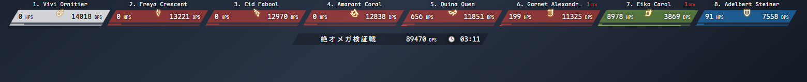
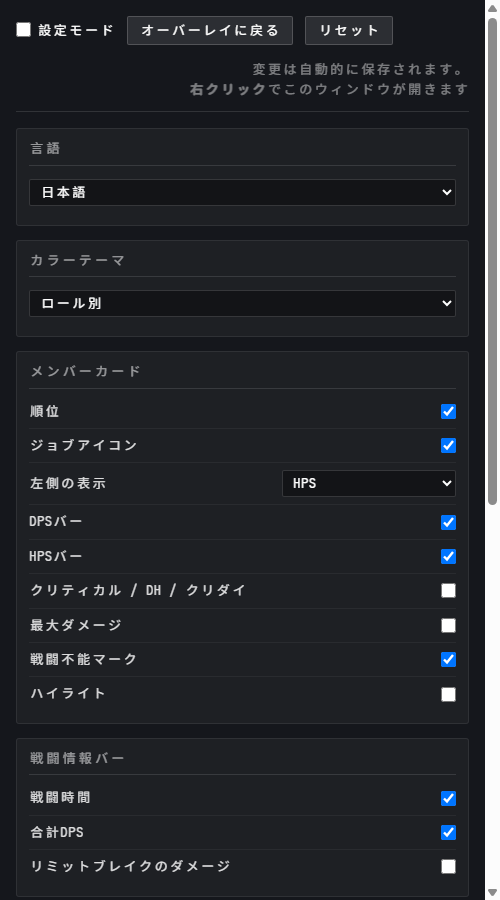
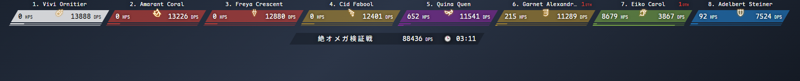
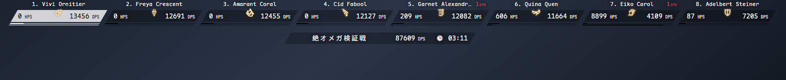
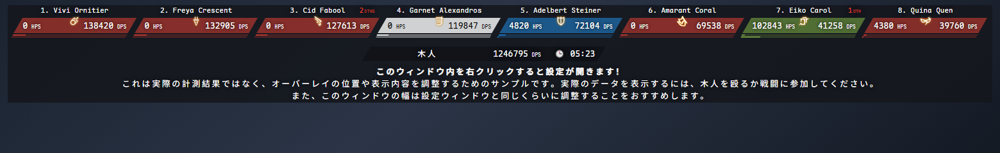
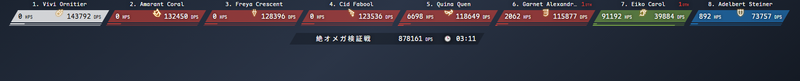
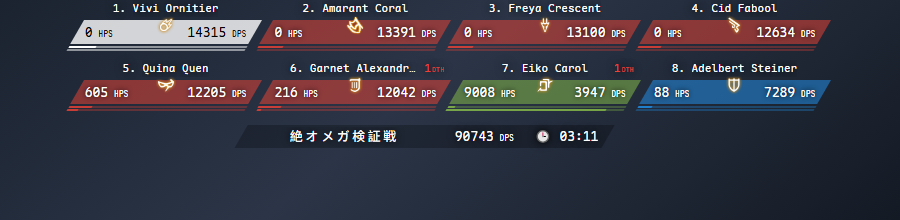

# Horizoverlay Reborn

[English](README.md) · 日本語 · [简体中文](README_zhCN.md) · [正體中文](README_zhHK.md) · [Português](README_ptBR.md) · [Français](README_frFR.md)

FFXIV 用の ACT 横型オーバーレイ。パーティ全員の DPS と HPS をカード一列で表示します。[Horizoverlay](https://github.com/bsides/horizoverlay) を作り直したものです。



## 導入

1. OverlayPlugin で MiniParse タイプのオーバーレイを新規作成
2. URL に次を入力：

   ```
   https://garfieldzasv.github.io/horizoverlay-reborn/
   ```

3. そのオーバーレイの **Enable clickthru** をオフにしてください。オンのままだと右クリックが届かず設定が開きません
4. オーバーレイ上で右クリックして設定画面へ

ネットに繋がずに使いたい場合は、[Releases](https://github.com/garfieldzasv/horizoverlay-reborn/releases) から zip を落として展開してください。最近の OverlayPlugin（各種パッケージ版はたいていこれです）なら URL 入力欄の横に `...` ボタンがあるので、展開した `index.html` を選ぶだけで済みます。古いバージョンの場合は `index.html` の `file://` フルパスを手で入力してください。ローカルもオンラインも中身は同じものですが、設定の保存はオンラインのほうが確実です。ブラウザが `file://` での `localStorage` を弾くことがあるためです。

ウィンドウ幅の目安：1 行に 4 人なら 759px、6 人 1138px、8 人 1517px、12 人 2276px、24 人 4551px。入りきらない分は自動で折り返します。

ACTWebSocket にも対応しています。URL の末尾に `?HOST_PORT=ws://127.0.0.1:10501/` を付けてください。この使い方はローカル版を推奨します。https のページから平文の `ws://` に繋げないことがあるためです。

## 機能

右クリックで設定画面が開きます。変更は即座に反映され、自動的に保存されます。



* インターフェースは 6 言語：英語、日本語、ポルトガル語、簡体字中国語、繁体字中国語、フランス語
* カラーテーマ 3 種：ロール別、モノクロ、ロール別（詳細）
* カード右半分は DPS、左半分は HPS / クリティカル率 / ダイレクトヒット率 / クリダイ率 / ジョブ から選択
* DPS と HPS、2 本の割合バー
* 順位、ジョブアイコン、最大ダメージ、ハイライトを個別に切り替え
* 戦闘情報バーに戦闘時間と合計 DPS、必要ならリミットブレイクのダメージも表示
* 表示人数は 1〜24 人。チョコボや召喚獣などジョブを持たないメンバーの表示も選択可
* 自分のカードは白で固定。自分だけを表示したり、他人の名前をぼかすこともできます
* 全体の表示倍率は 0.5〜2 倍
* 設定モードでは擬似データを使って、戦闘していなくても配置を調整できます
* Discord Webhook でワンクリック送信。名前を Player 1, 2, 3 に置き換えて送ることもできます

ロール別（詳細）テーマ。5 つのロールにそれぞれ別の色：



モノクロ：



設定モード：



## オリジナル版との違い

* 等幅の日中対応フォントを内蔵。DPS が毎秒更新されても数字が横に揺れません
* カードは 6 桁を想定した幅
* 入りきらないときは折り返します。カードが黙って切り捨てられることはありません
* ダメージ割合の数値表示をやめ、2 本目のバーで HPS 割合を表示
* 左半分は切り替え式。オリジナルは HPS 固定でした
* カード・バー・割合バーの斜めのエッジが自動で揃います
* ロール別（詳細）テーマを追加し、DPS を近接・遠隔物理・魔法に分けて色分け
* ジョブアイコンを 59 個に拡充。パッチ 7.56 の魔獣使いも含みます 
* ペットは召喚獣アイコンとニュートラルグレーに変更。オリジナルでは切断アイコンと真っ黒で表示されていました
* 設定画面を作り直し
* 外部への通信は一切なし。解析コードもなく、フォントとアイコンはすべて内蔵です（オリジナルのオンライン版には Google Analytics が埋め込まれています）

オリジナルはプロポーショナルフォントで、カードも狭いものでした：


こちらは 6 桁でも収まります：



同じ 900px 幅・同じ 8 人で、オリジナルは両端のカードが切れています：


こちらは 2 行に折り返します：



## よくある質問

**右クリックが効かない。** **Enable clickthru** がオフになっているか確認してください。URL の末尾に `#/config` を付けて設定画面を直接開くこともできます。

**設定を変えても再起動すると消える。** `file://` で `localStorage` が弾かれています。オンライン版を使うか、展開したフォルダをローカル HTTP サーバー経由で開いてください。

**特定の割合がすべて 0% になる。** お使いの ACT がその項目を送っていません。別の項目に切り替えてください。

**ジョブアイコンがカーバンクルになる。** そのメンバーが既知のペット名と一致しなかっただけで、動作に影響はありません。

その他のご質問・ご要望は [issue](https://github.com/garfieldzasv/horizoverlay-reborn/issues) へどうぞ。

## ビルド

Node.js が必要です。

```bash
npm install
npm run build
```

開発時は `npm start`。URL に `?mock=1#/` を付けると擬似データを流し込めます。テーマ・レイアウト・文字サイズの変更方法は [DEVLOG.md](DEVLOG.md) を参照してください。

## ライセンスと由来

[bsides/horizoverlay](https://github.com/bsides/horizoverlay)（Copyright 2017 Rafael "BSIDES" Pereira、Apache-2.0）から派生したもので、本プロジェクトも同じライセンスに従います。変更点の一覧は [NOTICE](NOTICE) にあります。

内蔵している Maple Mono CN は [subframe7536/maple-font](https://github.com/subframe7536/maple-font)（SIL Open Font License 1.1）です。woff2 に再パッケージしただけで、フォント自体には手を加えていません。

ジョブアイコンは FINAL FANTASY XIV のものです。FINAL FANTASY は Square Enix Holdings Co., Ltd. の登録商標であり、本プロジェクトは Square Enix とは無関係で、承認を受けたものでもありません。
