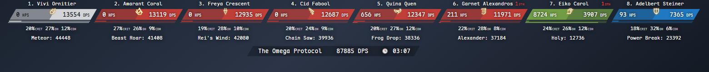
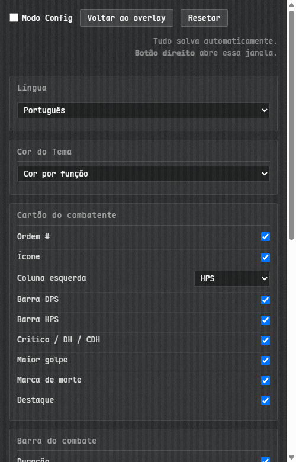
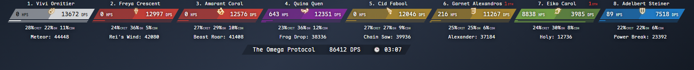
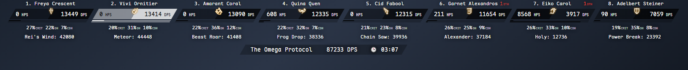
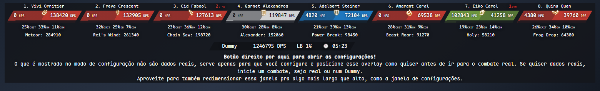
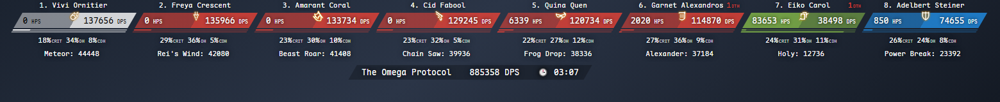
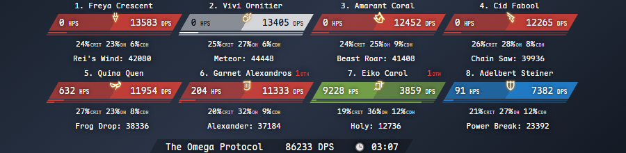

# Horizoverlay Reborn

[English](README.md) · [简体中文](README_zhCN.md) · [正體中文](README_zhHK.md) · Português · [Français](README_frFR.md)

Um medidor de dano horizontal para Final Fantasy XIV, que mostra o DPS e o HPS do grupo inteiro numa fileira de cartões. Uma reconstrução do [Horizoverlay](https://github.com/bsides/horizoverlay).



## Instalação

1. No OverlayPlugin, crie um overlay do tipo MiniParse
2. Coloque `https://garfieldzasv.github.io/horizoverlay-reborn/` na URL
3. Desligue o **Enable clickthru** desse overlay, senão o botão direito não abre as configurações
4. Clique com o botão direito no overlay para abrir as configurações

Se preferir não depender da rede, baixe o zip em [Releases](https://github.com/garfieldzasv/horizoverlay-reborn/releases), descompacte e aponte a URL para o `index.html` pelo caminho `file://` completo. É a mesma build, mas a versão hospedada guarda suas configurações de forma mais confiável, porque os navegadores bloqueiam `localStorage` em caminhos `file://`.

Largura da janela: uma fileira de 4 precisa de 759px, 6 precisam de 1138px, 8 precisam de 1517px, 12 precisam de 2276px, 24 precisam de 4551px. Os cartões quebram linha quando não cabem.

O ACTWebSocket também funciona, é só acrescentar `?HOST_PORT=ws://127.0.0.1:10501/` à URL. Para isso use a cópia local; uma página servida por https pode não conseguir abrir uma conexão `ws://` sem criptografia.

## Funcionalidades

Clique com o botão direito para abrir as configurações. Tudo vale na hora e se salva sozinho.



* Cinco idiomas de interface: inglês, português, chinês simplificado, chinês tradicional e francês
* Três temas de cor: por função, preto & branco, e por função detalhada
* A metade direita do cartão é DPS; a esquerda alterna entre HPS, taxa de crítico, taxa de acerto direto, taxa de crítico direto e o código do job
* Duas barras de participação, uma de DPS e outra de HPS
* Ordem, ícone do job, maior golpe e destaque, cada um com seu interruptor
* Barra do combate com duração e DPS total
* De 1 a 24 combatentes, com opção de incluir chocobos, egis e outras unidades sem job
* Seu próprio cartão fixado em branco; dá também para mostrar só você, ou borrar o nome dos outros
* Zoom de 0,5x a 2x
* Modo config, uma prévia com dados falsos para ajustar tudo fora de combate
* Webhook do Discord, que publica a luta no seu canal

O tema detalhado, uma cor por subfunção:



Preto & branco:



Modo config:



## O que mudou em relação ao original

* Fonte monoespaçada embutida, então os dígitos param de tremer a cada atualização do DPS
* Cartões dimensionados para números de seis dígitos
* Os cartões quebram linha em vez de serem cortados sem aviso
* A porcentagem de dano em texto saiu, no lugar entrou uma segunda barra para a cura
* A metade esquerda é selecionável; o original só oferecia HPS
* Cartões, barras e banners alinham as bordas inclinadas sozinhos
* Um tema a mais, que separa o DPS em corpo a corpo, ranged e caster
* 59 ícones de job, incluindo o Beastmaster  do patch 7.56
* Pets usam um ícone de invocação em cinza neutro, no lugar do ícone de rede desconectada em preto
* Página de configurações refeita
* Nenhuma requisição a terceiros e nenhum analytics; fontes e ícones vêm embutidos (a página hospedada do original carrega Google Analytics)

O original, com fonte proporcional e cartões mais estreitos:


Agora seis dígitos cabem:



Mesmos 900px, mesmos oito jogadores. O original perde o primeiro e o último cartão:


Agora quebra em duas fileiras:



## Perguntas frequentes

**O botão direito não faz nada.** Confira se o Enable clickthru está desligado. Dá também para acrescentar `#/config` à URL e abrir as configurações direto.

**As configurações somem quando reinicio.** O `localStorage` fica bloqueado num caminho `file://`. Use a URL hospedada, ou sirva a pasta descompactada por HTTP local.

**Uma porcentagem marca 0% para todo mundo.** Sua versão do ACT não fornece esse campo. Escolha outra.

**Um ícone de job virou um carbúnculo.** O nome daquela unidade não bateu com nenhum nome de pet conhecido. Nada quebra.

Para o resto, [abra uma issue](https://github.com/garfieldzasv/horizoverlay-reborn/issues).

## Compilando

Precisa de Node.js.

```bash
npm install
npm run build
```

Para desenvolver use `npm start` e acrescente `?mock=1#/` à URL para dados falsos. O [DEVLOG.md](DEVLOG.md) cobre como acrescentar um tema de cor e onde ficam a geometria do cartão e a escala tipográfica.

## Licença e créditos

Derivado de [bsides/horizoverlay](https://github.com/bsides/horizoverlay), Copyright 2017 Rafael "BSIDES" Pereira, Apache-2.0, e publicado sob a mesma licença. O [NOTICE](NOTICE) lista o que mudou.

A Maple Mono NF CN embutida vem de [subframe7536/maple-font](https://github.com/subframe7536/maple-font) sob a SIL Open Font License 1.1.

Os ícones de job derivam de arte de FINAL FANTASY XIV. FINAL FANTASY é marca registrada da Square Enix Holdings Co., Ltd. Este projeto não tem vínculo com a Square Enix nem endosso dela.
