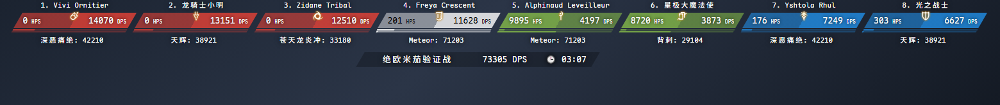
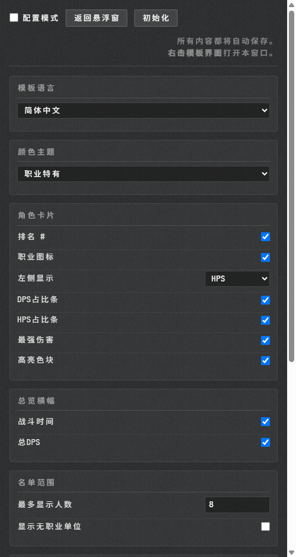
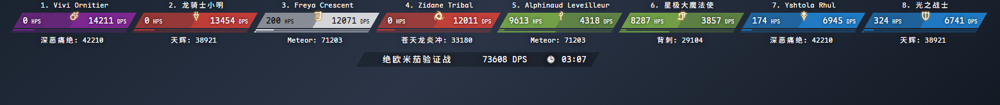
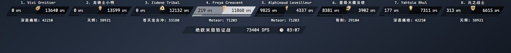
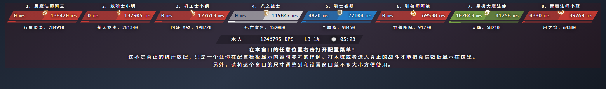
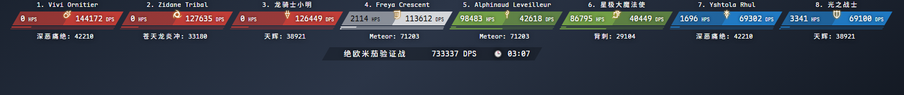
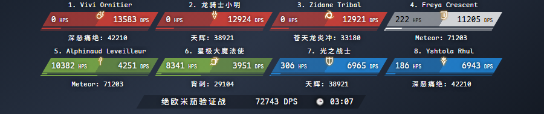

# Horizoverlay Reborn

[English](README.md) · 简体中文 · [正體中文](README_zhHK.md) · [Português](README_ptBR.md) · [Français](README_frFR.md)

FF14 的 ACT 横向悬浮窗，一排卡片显示全队的 DPS 和 HPS。基于 [Horizoverlay](https://github.com/bsides/horizoverlay) 重做。



## 安装

到 [Releases](https://github.com/garfieldzasv/horizoverlay-reborn/releases) 下载 zip 解压，或者 clone 本仓库用里面的 `build/` 目录。

1. 在 OverlayPlugin 里新建一个 MiniParse 类型的悬浮窗
2. URL 填 `index.html` 的完整 `file://` 地址
3. 关掉这个悬浮窗的「滑鼠穿透 / Enable clickthru」，不然右键呼不出配置
4. 在悬浮窗上右键，打开配置页

窗口宽度：一行放下 4 个人需要 759px，6 个人 1138px，8 个人 1517px，12 个人 2276px，24 个人 4551px。放不下会自动折行。

也支持 ACTWebSocket，URL 后面加 `?HOST_PORT=ws://127.0.0.1:10501/`。

## 功能

右键打开配置页，所有改动即时生效并自动保存。



* 五种界面语言：英语、葡萄牙语、简体中文、正體中文、法语
* 三套颜色主题：职业特有、黑白色调、细分职业
* 卡片右半格是 DPS，左半格可切换 HPS、暴击率、直击率、直暴率或职业缩写
* DPS 和 HPS 两条占比横条
* 排名序号、职业图标、最强一击、高亮色块，各自可开关
* 总览横幅显示战斗时间和总 DPS
* 显示人数 1 到 24，可选是否显示陆行鸟、召唤兽等无职业单位
* 自己的卡片固定为白色；也可以只显示自己，或者模糊掉别人的名字
* 整体缩放 0.5 到 2 倍
* 配置模式，用模拟数据预览，没开打也能调
* Discord Webhook，一键把战绩发到频道

细分职业主题，五职能各一色：



黑白色调：



配置模式：



## 和原版的区别

* 内置等宽中日文字体，DPS 刷新时数字不再左右抖
* 卡片按 6 位数预留宽度
* 放不下会折行，不会静默裁掉卡片
* 去掉伤害占比的百分比数字，改成第二条横条显示 HPS 占比
* 左半格可切换，原版只有 HPS 一项
* 卡片、横幅和占比条自动斜边对齐
* 多一套细分职业主题，把输出拆成近战、远敏、法系
* 职业图标补到 59 个，含 7.56 的驯兽师 
* 宠物改用召唤兽图标和中性灰，原版显示成断网图标加纯黑
* 配置页重做
* 完全离线，运行时不请求任何外部地址

原版用比例字体，卡片也窄：


现在六位数也放得下：



同样 900px 宽、同样 8 个人，原版把首尾两张卡裁掉了：


现在折成两行：



## 常见问题

**右键没反应。** 确认「滑鼠穿透 / Enable clickthru」是关闭的。也可以在 URL 末尾加 `#/config` 直接打开配置页。

**设置改了但重启就丢。** `localStorage` 在 `file://` 下被拦了，改用本地 HTTP 服务指向解压出来的目录。

**某个百分比全是 0%。** 你这个版本的 ACT 没提供那个字段，换一项。

**职业图标变成宝石兽。** 那个单位没匹配上已知的宠物名，不影响使用。

其他问题和建议请 [开 issue](https://github.com/garfieldzasv/horizoverlay-reborn/issues)。

## 构建

需要 Node.js。

```bash
npm install
npm run build
```

开发用 `npm start`，URL 加 `?mock=1#/` 可以灌模拟数据。改主题、几何和字号的做法见 [DEVLOG.md](DEVLOG.md)。

## 许可与来源

衍生自 [bsides/horizoverlay](https://github.com/bsides/horizoverlay)，Copyright 2017 Rafael "BSIDES" Pereira，Apache-2.0，本项目沿用同一许可。改动清单见 [NOTICE](NOTICE)。

内置的 Maple Mono NF CN 来自 [subframe7536/maple-font](https://github.com/subframe7536/maple-font)，SIL Open Font License 1.1。

职业图标取自 FINAL FANTASY XIV。FINAL FANTASY 是 Square Enix Holdings Co., Ltd. 的注册商标，本项目与 Square Enix 无关联，也未获其背书。
